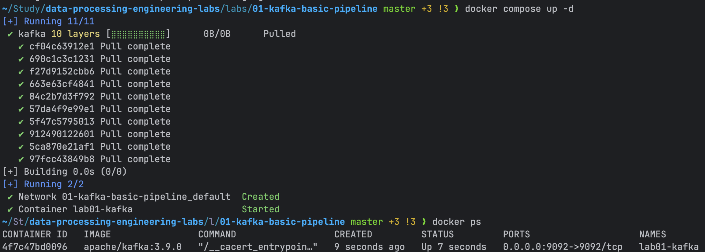
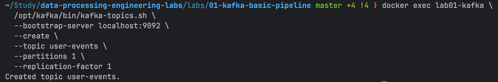
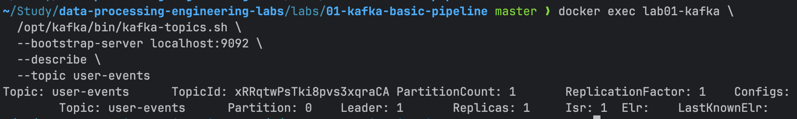
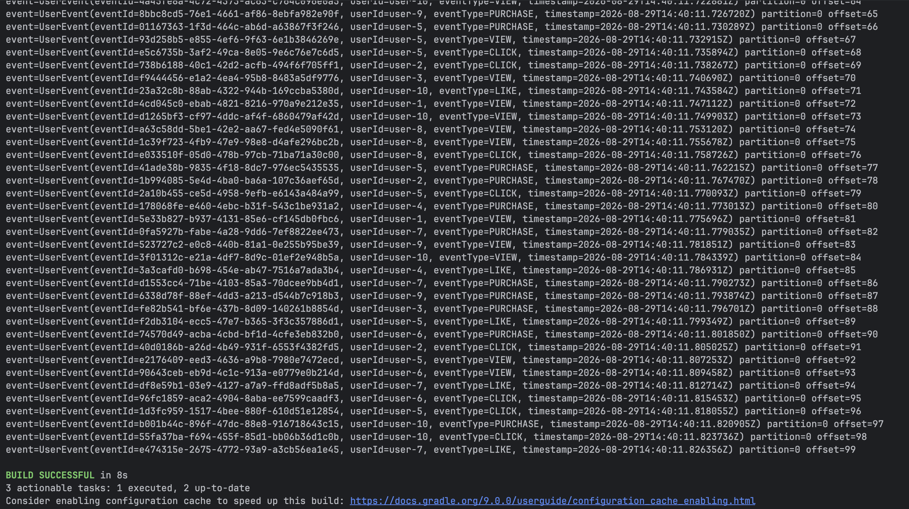
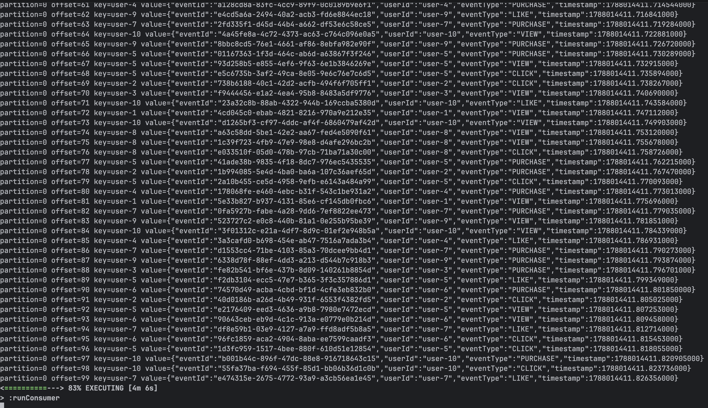

# Lab 01. Kafka Basic Pipeline

## Goals

Producer → Kafka → Consumer 기본 흐름을 구성하고, Topic, Partition, Offset, Consumer Lag를 직접 관찰한다.

---

## Implementation

### Kafka Client

Spring Kafka를 사용하지 않고 Kafka Java Client를 직접 사용했다.

Lab 01의 목적은 Kafka 자체의 Producer / Consumer 동작과 메시지 흐름을 직접 관찰하는 것이므로,
Spring Kafka가 제공하는 추상화를 사용하지 않았다.

### Configuration

Kafka 설정은 코드에 직접 작성하지 않고 `application.yml`에 분리했다.

Jackson YAML을 이용해 설정 파일을 Kotlin configuration object로 역직렬화한 뒤,
Kafka Client가 사용하는 `Properties` 형태로 변환하여 Producer와 Consumer에 전달한다.

### Event Model

Producer는 단순 문자열 대신 실제 이벤트 형태의 데이터를 발행하도록 구성했다.

## How to Run

### 1. 카프카 실행

```bash
docker compose up -d

# 상태 확인
docker ps
```




### 2. 토픽 생성
```bash
docker exec lab01-kafka \
  /opt/kafka/bin/kafka-topics.sh \
  --bootstrap-server localhost:9092 \
  --create \
  --topic user-events \
  --partitions 1 \
  --replication-factor 1
```



### 3. 프로듀서 실행
```bash
./gradlew runProducer
```

### 4. 컨슈머 실행
```bash
./gradlew runConsumer
```

## Experiment 1. 토픽 구조

### 명령어
```bash
docker exec lab01-kafka \
  /opt/kafka/bin/kafka-topics.sh \
  --bootstrap-server localhost:9092 \
  --describe \
  --topic user-events
```

### 실제 출력


### 결과
- PartitionCount가 1로 생성된 것을 확인했다.
- Kafka의 Partition 번호는 0부터 시작하므로 생성된 Partition은 Partition 0이다.
- Partition 0의 Leader는 broker 1이다.
- Replicas와 ISR 모두 broker 1만 포함한다.

### 해석 및 궁금증
- Lab 01에서는 기본 메시지 흐름을 관찰하는 것이 목적이므로 최소 구성으로 시작했다.
- 현재 실습 환경은 단일 broker이며 replication factor도 1이다.
- 따라서 Partition 0의 Leader와 Replica가 모두 broker 1에 존재한다.
- 현재 ISR에도 broker 1만 존재한다.
- Leader broker에 장애가 발생할 경우 해당 Partition을 대신 처리할 replica가 존재하지 않는다.

## Experiment 2. Producer Event 발행

### 목적

Producer가 `user-events` Topic에 이벤트를 발행하고,
Kafka가 각 Record에 Partition과 Offset을 어떻게 부여하는지 확인한다.

### 명령어

~~~bash
./gradlew runProducer
~~~

### 실제 출력



### 결과

- Producer가 여러 개의 UserEvent를 정상적으로 Kafka에 발행했다.
- 모든 이벤트가 partition=0에 기록되었다.
- Record가 추가될 때마다 Offset이 증가하는 것을 확인했다.
- Message Key에는 userId가 사용되었다.

### 해석 및 궁금증

- 현재 Topic에는 Partition이 1개만 존재하므로 모든 Record는 Partition 0에 저장된다.
- 현재는 단일 Partition이라 Message Key에 따른 분산 효과는 관찰할 수 없다.

## Experiment 3. Consumer Event 소비

### 목적

Consumer가 user-events Topic의 Record를 정상적으로 소비하는지 확인하고,
Partition과 Offset 정보를 함께 관찰한다.

### 명령어

~~~bash
./gradlew runConsumer
~~~

### 실제 출력



### 결과

- Consumer가 Producer가 발행한 이벤트를 정상적으로 읽었다.
- 모든 Record가 partition=0에서 소비되었다.
- Consumer 출력에서 각 Record의 Offset을 확인할 수 있었다.
- Producer에서 설정한 userId가 Message Key로 전달된 것을 확인했다.

### 해석 및 궁금증

- Kafka Consumer는 Topic의 Partition에서 Record를 읽는다.
- 현재 Topic에는 Partition 0 하나만 존재하므로 모든 이벤트를 해당 Partition에서 소비한다.
- Consumer는 각 Record의 Partition과 Offset 정보를 통해 어느 위치의 데이터를 읽고 있는지 확인할 수 있다.
- Producer와 Consumer는 직접 연결되지 않고 Kafka Topic을 사이에 두고 독립적으로 동작한다.
- Consumer를 재실행했을때 이전에 읽은 Record를 읽지 않는 것을 확인했다.

---

## Troubleshooting

### 1. YAML 설정이 Kotlin Configuration Object에 매핑되지 않는 문제

#### 상황

Kafka Client 설정을 코드에서 분리하기 위해 application.yml을 작성하고,
Jackson YAML을 사용해 Kotlin configuration object로 역직렬화했다.

실행 과정에서 MissingKotlinParameterException이 발생했다.

YAML에서는 다음과 같이 kebab-case를 사용했다.

~~~yaml
bootstrap-servers: localhost:9092
key-serializer: org.apache.kafka.common.serialization.StringSerializer
~~~

반면 Kotlin property는 camelCase로 정의되어 있었다.

~~~kotlin
data class KafkaConfig(
    val bootstrapServers: String
)

data class ProducerConfig(
    val keySerializer: String,
    val valueSerializer: String
)
~~~

#### 원인

Jackson의 기본 설정에서는 YAML의 kebab-case property와
Kotlin의 camelCase property를 자동으로 매핑하지 못했다.

예를 들어 다음 두 이름은 기본 상태에서는 동일한 property로 인식되지 않았다.

~~~text
YAML    : key-serializer
Kotlin  : keySerializer
~~~

그 결과 keySerializer에 값이 전달되지 않았고,
해당 property가 non-null 타입이기 때문에 MissingKotlinParameterException이 발생했다.

#### 해결

Jackson `ObjectMapper`에 `KEBAB_CASE` naming strategy를 추가했다.

~~~kotlin
private val mapper = ObjectMapper(YAMLFactory())
    .registerKotlinModule()
    .setPropertyNamingStrategy(PropertyNamingStrategies.KEBAB_CASE)
~~~

이후 YAML의 kebab-case property가 Kotlin의 camelCase property에 정상적으로 매핑되었다.

---

## Key Takeaways

- Kafka Topic은 하나 이상의 Partition으로 구성되며 Partition 번호는 0부터 시작한다.
- Partition의 Leader broker가 해당 Partition에 대한 요청을 처리한다.
- Replicas는 해당 Partition의 복제본을 가지고 있는 broker 목록이다.
- ISR은 현재 Leader와 충분히 동기화된 Replica 집합이다.
- 단일 broker / replication factor 1 환경에서는 Leader 장애 시 대체할 Replica가 없다.
- Producer가 Record를 저장하면 Partition 내부에서 Offset이 증가한다.
- Consumer는 Topic의 Partition에서 Record를 읽으며 Partition과 Offset을 기준으로 데이터 위치를 확인할 수 있다.
- Producer와 Consumer는 Kafka Topic을 사이에 두고 직접적으로 결합되지 않은 상태로 동작한다.
- Consumer가 중단된 뒤 재실행해도 마지막으로 읽고난 후의 Offset부터 처리하는 것을 확인했다.