# Lab 03. Kafka Consumer Group & Rebalance

## Goals

- Consumer Group 안에서 Partition이 Consumer에게 할당되는 방식을 확인한다.
- Consumer가 추가되거나 종료될 때 Rebalance가 발생하는 과정을 관찰한다.
- Consumer 수와 Partition 수의 관계를 이해한다.
- Rebalance 과정에서 Partition이 revoke되고 다시 assign되는 시점을 확인한다.
- Kafka AdminClient로 Topic과 Consumer Group 상태를 조회하고, Kafka CLI 결과와 교차 검증한다.

## Implementation

이번 Lab은 하나의 Kafka Topic과 Producer, Consumer Group으로 구성한다.

- `order-events` Topic은 6개의 Partition으로 구성한다.
- `OrderEventProducer`
  - Lab 02와 동일하게 `orderId`를 Message Key로 사용해 주문 이벤트 100건을 전송한다.
- `OrderEventConsumer`
  - 모든 컨슈머는 기본적으로 `lab03-order-processors` 컨슈머 그룹에 참여한다.
  - 실행 인자로 받은 식별자를 `client.id`와 Record 로그에 사용한다.
  - `RebalanceLoggingListener`로 Assigned/Revoked Partition을 기록한다.
  - 수신한 Record의 Partition, Offset, Key와 Value를 출력한다.
- `KafkaAdmin`
  - Producer나 Consumer와 분리된 실행 진입점으로 구성한다.
  - Topic 생성·조회와 Consumer Group 조회 명령을 제공한다.
  - AdminClient의 비동기 결과가 완료될 때까지 기다린 뒤 성공과 실패를 호출자에게 전달한다.
  - Producer 또는 Consumer 시작 과정에서 Topic을 암묵적으로 생성하지 않는다.
  - Kafka CLI는 AdminClient 결과를 독립적으로 검증하는 관찰 도구로 유지한다.

첫 번째 실험에서는 Lab 02의 실행 구조를 유지한 상태에서 별도의 AdminClient 진입점을 추가했다. `create-topic`, `describe-topic`, `describe-group` 명령으로 Topic을 준비하고 단일 Consumer의 Partition Assignment를 조회한다.

## How to Run

### 1. 카프카 실행

```bash
docker compose up -d
docker compose ps
```

### 2. 토픽 생성

JVM AdminClient로 Topic을 준비하고, Kafka CLI는 결과를 교차 검증하는 용도로 사용한다.

지원하는 Admin 명령을 확인한다.

```bash
./gradlew runAdmin
```

다음 명령을 순서대로 실행한다.

```bash
./gradlew runAdmin --args="create-topic"
./gradlew runAdmin --args="describe-topic"
```

Topic의 Partition 수를 확인한다.

```bash
docker exec lab03-kafka \
  /opt/kafka/bin/kafka-topics.sh \
  --bootstrap-server localhost:9092 \
  --describe \
  --topic order-events
```

### 3. 빌드와 테스트

```bash
./gradlew clean test
```

### 4. 프로듀서 실행

별도 Terminal에서 실행한다.

```bash
./gradlew runProducer
```

### 5. 컨슈머 실행

다른 Terminal에서 실행한다.

```bash
./gradlew runConsumer --args="c1"
```

### 6. 컨슈머 그룹 확인

Experiment 1에서 AdminClient 기반 조회를 구현한 뒤 JVM 출력과 아래 Kafka CLI 출력을 비교한다.

```bash
./gradlew runAdmin --args="describe-group"
```

```bash
docker exec lab03-kafka \
  /opt/kafka/bin/kafka-consumer-groups.sh \
  --bootstrap-server localhost:9092 \
  --describe \
  --group lab03-order-processors \
  --members \
  --verbose
```

## Experiment 1. Assign Six Partitions to One Consumer

### 목적

- 6개의 Partition을 가진 Topic을 하나의 Consumer가 구독했을 때 전체 Partition이 해당 Consumer에 할당되는지 확인한다.
- Consumer가 실제로 처리한 Partition과 Kafka CLI의 Assignment가 일치하는지 확인한다.
- Partition마다 Offset이 독립적으로 증가하는지 확인한다.
- Topic 생성·조회와 Consumer Group 조회를 Producer/Consumer가 아닌 별도 AdminClient 진입점에서 수행한다.
- AdminClient와 Kafka CLI가 같은 Topic 및 Assignment 상태를 보여주는지 교차 검증한다.

### 명령어

Kafka를 시작하고 AdminClient로 Topic을 생성·조회했다.

```bash
docker compose up -d
./gradlew runAdmin --args="create-topic"
./gradlew runAdmin --args="describe-topic"
```

Kafka CLI로 Topic 구성을 교차 검증했다.

```bash
docker exec lab03-kafka \
  /opt/kafka/bin/kafka-topics.sh \
  --bootstrap-server localhost:9092 \
  --describe \
  --topic order-events
```

서로 다른 Terminal에서 Consumer와 Producer를 실행했다.

```bash
# Ex2 변경 반영
./gradlew runConsumer --args="c1"
./gradlew runProducer
```

AdminClient와 Kafka CLI로 `lab03-order-processors` Group을 각각 조회했다.

```bash
./gradlew runAdmin --args="describe-group"

docker exec lab03-kafka \
  /opt/kafka/bin/kafka-consumer-groups.sh \
  --bootstrap-server localhost:9092 \
  --describe \
  --group lab03-order-processors \
  --members \
  --verbose
```

### 실제 출력

Topic은 최초 생성에 성공했으며, 동일 이름으로 다시 생성했을 때 `TopicExistsException`이 반환되었다.

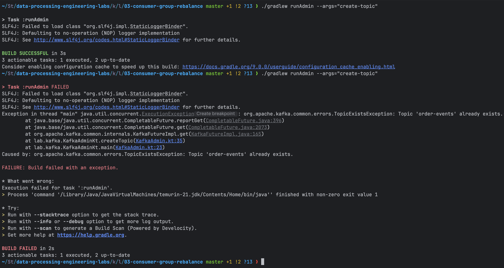

AdminClient와 Kafka CLI 모두 `order-events`의 Partition 수를 6개, Replication Factor를 1로 조회했다.

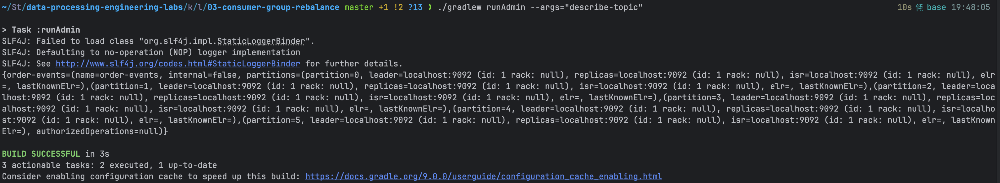

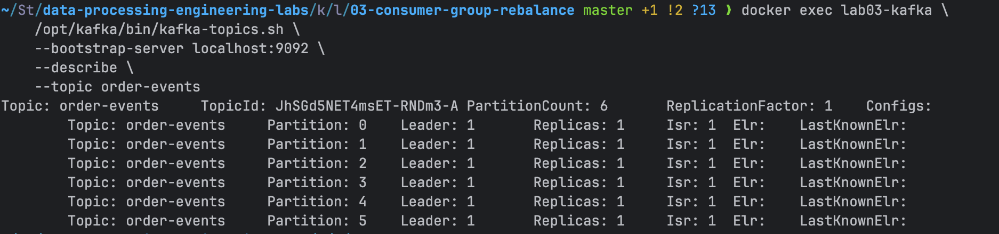

Producer가 `orderId`를 Key로 사용해 주문 이벤트 100건을 전송했다.

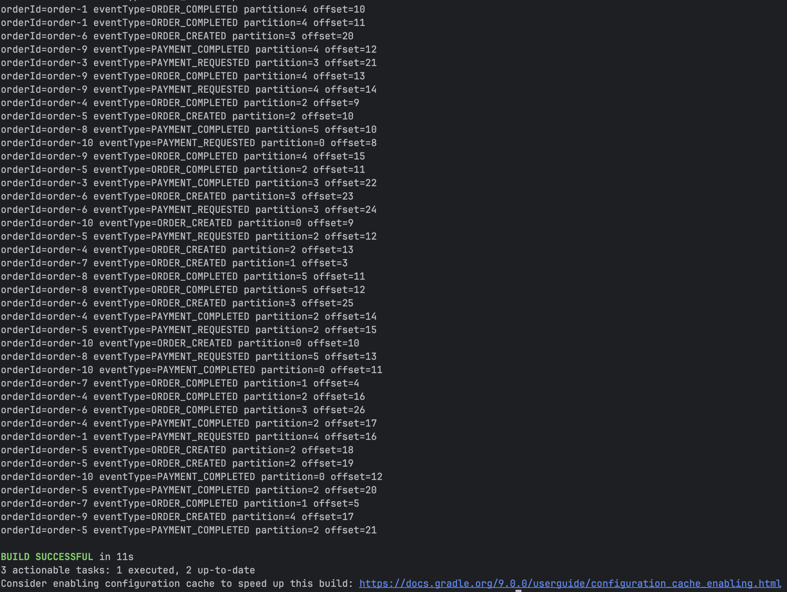

단일 Consumer가 Partition 0부터 5까지의 Record를 처리했다. 각 Partition의 Offset은 서로 독립적으로 증가했다.

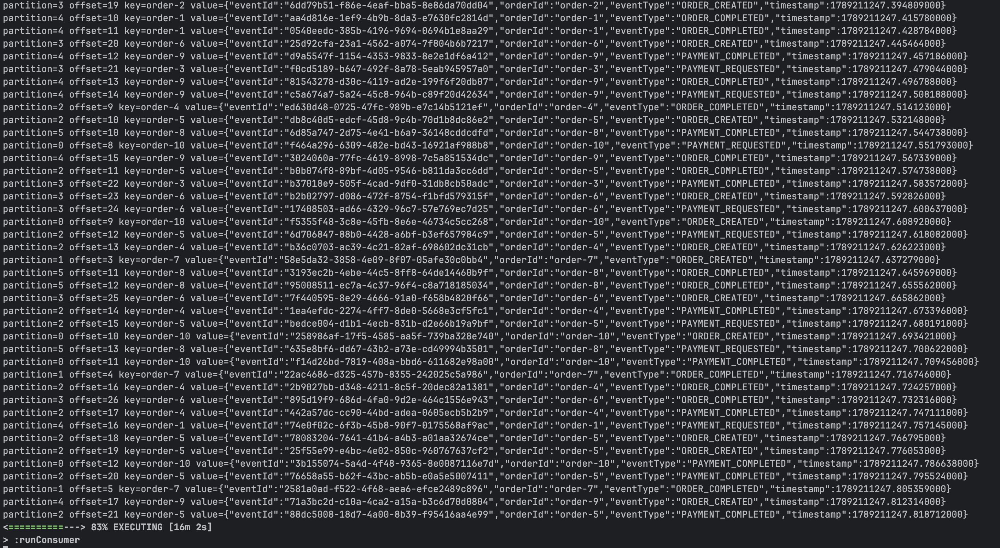

AdminClient 조회에서 Group은 `Stable`, Assignor는 `range`, Group Type은 `Classic`으로 나타났다. 단일 Member에는 Partition 0부터 5까지 할당되었다.

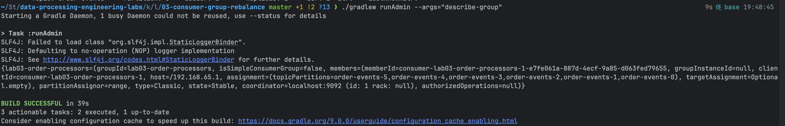

Kafka CLI에서도 동일한 Member 한 개와 Partition 6개의 Assignment `(0,1,2,3,4,5)`를 확인했다.

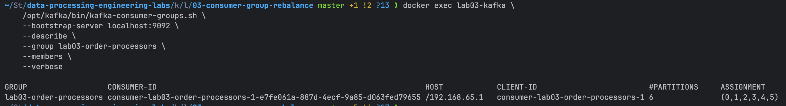

### 결과

| Consumer 수 | Group 상태 | Assignor | Assigned Partitions | 처리 Record 수 |
|---:|---|---|---|---:|
| 1 | Stable | range | 0, 1, 2, 3, 4, 5 | 100 |

| 검증 항목 | AdminClient | Kafka CLI | 비교 결과 |
|---|---|---|---|
| Topic Partition 수 | 6 | 6 | 일치 |
| Replication Factor | 1 | 1 | 일치 |
| Consumer 수 | 1 | 1 | 일치 |
| Assigned Partition 수 | 6 | 6 | 일치 |
| Assignment | 0, 1, 2, 3, 4, 5 | 0, 1, 2, 3, 4, 5 | 일치 |

단일 Consumer가 6개 Partition을 모두 할당받아 처리했다. Producer가 생성한 100건은 Partition별로 분산되었고, 단일 Consumer가 모든 Partition의 Record를 처리했다.

### 해석 및 궁금증

- 컨슈머 그룹의 병렬 처리 단위는 컨슈머가 아니라 파티션이다. 그룹에 멤버가 하나뿐이므로 구독 대상인 파티션 6개를 해당 컨슈머가 모두 할당받았다.
- 캡처에서 Partition별 Offset은 각각 증가하지만 서로 다른 Partition의 Record는 섞여 출력된다. 따라서 하나의 Consumer가 모든 Partition을 처리하더라도 Topic 전체 순서는 보장되지 않고 Partition 내부 순서만 관찰할 수 있다.
- AdminClient와 Kafka CLI의 결과는 이번 조회에서 일치했다.

## Experiment 2. Scale Consumers from One to Three

### 목적

- 같은 컨슈머 그룹의 컨슈머를 1개에서 2개, 3개로 늘릴 때 파티션이 어떻게 재할당되는지 확인한다.
- 컨슈머 증설 전후에 모든 컨슈머 로그에서 레코드 출력이 끊긴 간격을 관찰하고, 이 값이 리밸런싱 자체의 소요 시간과 다른 이유를 확인한다.
- 각 컨슈머를 구분하고 할당·반납된 파티션을 확인할 수 있도록 기본 컨슈머를 확장한다.
- 컨슈머를 늘리는 동안에도 레코드가 계속 들어오도록 프로듀서 실행 방식을 확장한다.

### 명령어

2번의 독립된 실험으로 나누어 실험했다.

첫 번째 실험에서는 c1에 파티션이 할당된 상태를 확인한 뒤 c2를 합류시키고, AdminClient로 멤버가 2개인 상태를 조회했다. 이 실험에서는 레코드가 계속 들어오지 않았으므로 처리 시간은 계산하지 않았다.

```bash
docker compose down
docker compose up -d
./gradlew runAdmin --args="create-topic"

./gradlew runConsumer --args="c1"
./gradlew runConsumer --args="c2"
./gradlew runAdmin --args="describe-group"
```

첫 번째 실험을 종료한 뒤 Kafka와 토픽을 다시 초기화했다. 두 번째 실험에서는 프로듀서를 `continuous` 모드로 실행해 100ms 간격으로 레코드를 보냈다. 이 상태에서 c1부터 다시 시작해 c2와 c3을 순서대로 합류시켰다.

```bash
docker compose down
docker compose up -d
./gradlew runAdmin --args="create-topic"

./gradlew runConsumer --args="c1"
./gradlew runProducer --args="continuous"
./gradlew runConsumer --args="c2"
./gradlew runConsumer --args="c3"
```

### 실제 출력

#### 첫 번째 실험: 파티션 할당 확인

첫 번째 실험에서 c1은 파티션 0~5를 모두 할당받았다.

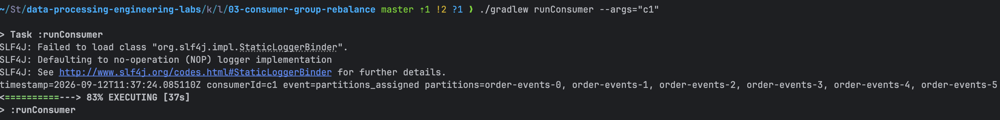

c2가 합류하자 c1은 기존 파티션 6개를 모두 반납한 뒤 파티션 0, 1, 2를 다시 할당받았다.

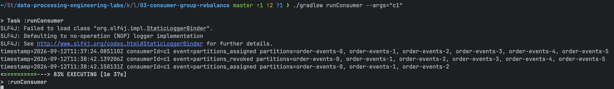

c2는 파티션 3, 4, 5를 할당받았다.

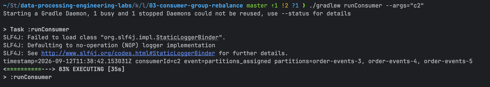

첫 번째 실험의 AdminClient 조회에서도 c1은 파티션 0~2, c2는 파티션 3~5를 소유한 것으로 확인되었다.

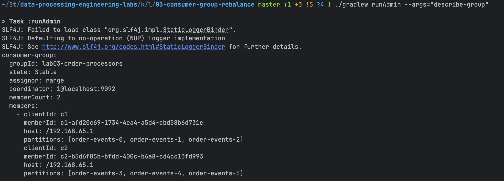

#### 두 번째 실험: 레코드가 유입되는 동안 컨슈머 증설

두 번째 실험은 Kafka와 토픽을 다시 초기화하고 c1부터 시작했다. 프로듀서가 `continuous` 모드로 실행되는 동안 c2가 합류하자 c1은 파티션 6개를 모두 반납한 뒤 파티션 0, 1, 2를 다시 할당받았다.

리밸런싱 직전 전체 로그의 마지막 레코드와 리밸런싱 이후 처음 출력된 레코드 사이에는 약 136ms의 간격이 있었다.

이 값은 리밸런싱 자체의 소요 시간이 아니다. 프로듀서의 100ms 전송 주기, 키에 따른 파티션 분포, 레코드를 가져오는 시간과 애플리케이션 출력 시간이 모두 포함되어 있다.

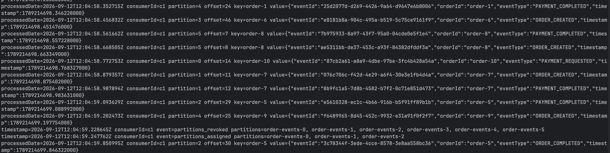

c2는 파티션 3, 4, 5를 할당받아 레코드 처리를 시작했다.

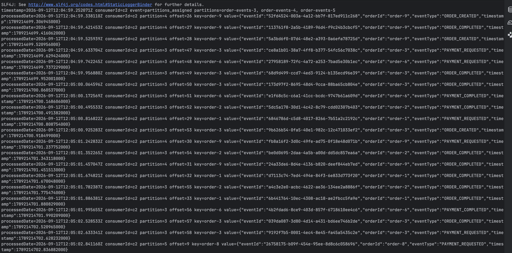

c3가 합류하자 c1은 파티션 0~2를 반납한 뒤 파티션 0, 1을 할당받았다.

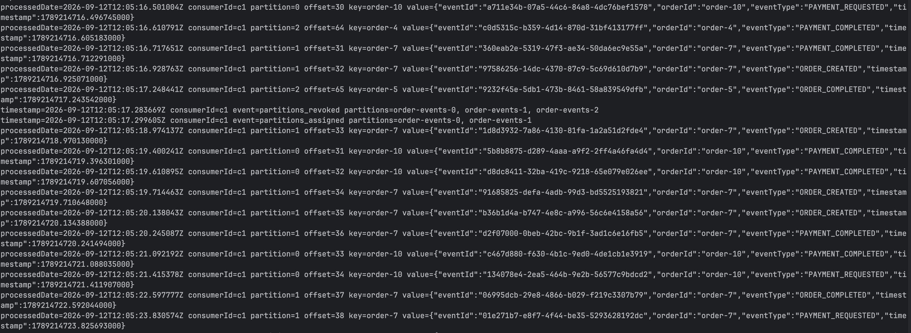

c2는 파티션 3~5를 반납한 뒤 파티션 2, 3을 할당받았다.

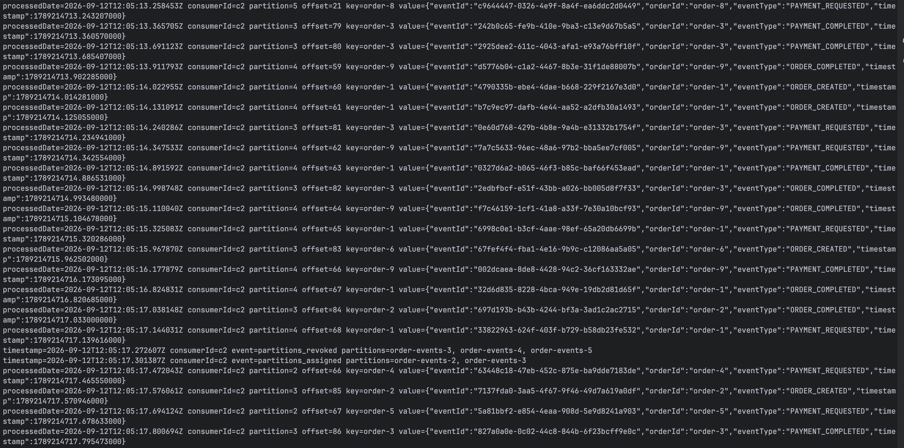

c3는 파티션 4, 5를 할당받고 레코드 처리를 시작했다. 멤버가 3개인 최종 상태는 세 컨슈머의 콜백 로그로 확인했으며 따로 브로커에 컨슈머 그룹 상태를 조회하지 않았다.

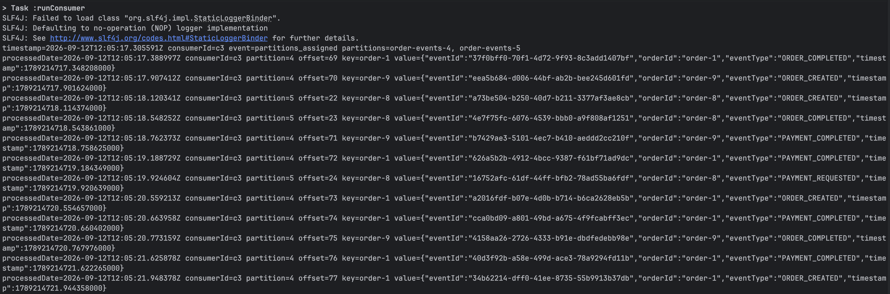

### 결과

| 실행 | 컨슈머 수 | c1 파티션 | c2 파티션 | c3 파티션 | 소유자가 바뀐 파티션 수 | 전체 컨슈머의 레코드 출력 공백 |
|---|---:|---|---|---|---:|---:|
| 첫 번째: 할당 확인 | 1 | 0, 1, 2, 3, 4, 5 | - | - | 0 | 측정하지 않음 |
| 첫 번째: 할당 확인 | 2 | 0, 1, 2 | 3, 4, 5 | - | 3 | 측정하지 않음 |
| 두 번째: 지속 처리 | 1 | 0, 1, 2, 3, 4, 5 | - | - | 0 | - |
| 두 번째: 지속 처리 | 2 | 0, 1, 2 | 3, 4, 5 | - | 3 | 약 136ms |
| 두 번째: 지속 처리 | 3 | 0, 1 | 2, 3 | 4, 5 | 3 | 약 141ms |

전체 컨슈머의 레코드 출력 공백은 같은 `group.id`에 속한 모든 컨슈머의 로그를 하나의 시간축으로 합친 뒤, 리밸런싱 직전 마지막 `processedDate`와 리밸런싱 후 가장 빠른 `processedDate`의 차이로 계산했다. c2 합류 시에는 `12:04:59.202473Z`부터 `12:04:59.338110Z`까지 약 136ms, c3 합류 시에는 `12:05:17.248441Z`부터 `12:05:17.388997Z`까지 약 141ms다.

c2 합류 시에는 다음 시간축도 별도로 확인했다.

| 관찰 지점 | 시각 | 이전 지점과의 간격 |
|---|---|---:|
| c1의 리밸런싱 전 마지막 레코드 처리 | `12:04:59.202473Z` | - |
| c1의 `partitions_revoked` 콜백 | `12:04:59.228645Z` | 약 26ms |
| c1의 `partitions_assigned` 콜백 | `12:04:59.247762Z` | 약 19ms |
| c2의 `partitions_assigned` 콜백 | `12:04:59.250071Z` | - |
| c2의 첫 레코드 처리 | `12:04:59.338110Z` | c2 할당 후 약 88ms |
| c1의 첫 레코드 처리 | `12:04:59.850995Z` | c1 할당 후 약 603ms |

c1만 보면 마지막 레코드부터 다음 레코드까지 약 649ms의 간격이 있다. 그러나 c1이 다음에 처리한 이벤트의 생성 시각도 약 `12:04:59.846Z`이므로, c1이 할당 후 기존 레코드를 약 603ms 동안 처리하지 못했다고 볼 근거는 없다. c1이 소유한 파티션 0, 1, 2로 다음 레코드가 들어올 때까지 기다린 시간이 대부분 포함된 것으로 해석한다.

따라서 약 136ms는 모든 컨슈머의 로그를 합쳤을 때 관찰된 두 레코드 출력 사이의 간격이고, 약 649ms는 c1에서 레코드가 출력된 간격이다. 약 19ms도 c1의 파티션 반납 콜백과 할당 콜백 사이의 간격일 뿐 리밸런싱 전체 소요 시간은 아니다. 현재 로그만으로 리밸런싱 자체의 소요 시간을 따로 계산할 수는 없다.

### 해석 및 궁금증

- 같은 컨슈머 그룹의 컨슈머들은 동일한 레코드를 함께 처리하지 않고 파티션을 나누어 맡는다. 그룹 상태가 안정되면 하나의 파티션은 한 멤버에게만 할당되므로 컨슈머를 늘리는 과정에서 일부 파티션의 소유자가 바뀌었다.
- 파티션 6개는 컨슈머가 2개일 때 3개씩, 3개일 때 2개씩 균등하게 나뉘었다. 파티션 수가 컨슈머 수로 나누어떨어지지 않으면 완전히 균등하게 나눌 수 없다.
- Range Assignor의 eager 리밸런싱에서는 c1과 c2가 나중에도 유지할 파티션까지 일단 모두 반납한 후 다시 할당받았다. 실제 소유자가 바뀐 파티션은 컨슈머를 늘릴 때마다 3개였지만 `partitions_revoked` 콜백에는 그보다 많은 파티션이 포함되었다.
- c2 합류 시 c1의 레코드 출력 간격은 약 649ms였지만 모든 컨슈머의 로그에서 레코드 출력이 끊긴 간격은 약 136ms였다. c1의 다음 레코드 자체가 늦게 생성되었으므로 두 값의 차이를 c1의 리밸런싱 지연으로 해석하지 않는다.
- 어떤 조건이 리밸런싱과 처리 재개를 늦추는지는 이번 실험만으로 알 수 없다. 후속 실험에서 종료 방식, 타임아웃, 컨슈머와 파티션 수, 파티션 할당 전략, 리밸런싱 콜백의 작업 시간과 코디네이터까지의 네트워크 지연을 하나씩 바꾸며 비교해 보면 좋을 것 같다.

## Troubleshooting

### `createTopics()`를 호출해도 중복 생성이 모두 성공한 것처럼 보임

- 증상: `admin.createTopics(listOf(newTopic))`만 호출했을 때 같은 명령을 반복해도 Gradle 실행이 성공으로 종료되었다.
- 원인: `createTopics()`는 비동기 결과인 `CreateTopicsResult`를 반환한다. 반환된 Future의 완료 결과를 확인하지 않아 Broker가 반환한 실패가 실행 스레드로 전파되지 않았다.
- 해결: `admin.createTopics(...).all().get()`으로 전체 Topic 생성 결과를 기다렸다.
- 확인: 첫 번째 생성은 성공했고, 같은 Topic을 다시 생성했을 때 `ExecutionException`의 원인으로 `TopicExistsException`이 출력되며 실행이 실패했다.
- 재발 방지: AdminClient의 변경 작업은 요청 전송 성공과 Broker 반영 성공을 구분하고, 완료 Future와 Topic별 오류를 반드시 확인한다.


### SLF4J Logger Binder 경고

- 증상: AdminClient 실행마다 `Failed to load class org.slf4j.impl.StaticLoggerBinder`와 NOP Logger 경고가 출력되었다.
- 원인: Kafka Client가 사용하는 SLF4J API에 대응하는 Logging 구현체를 현재 Lab의 Runtime Dependency로 추가하지 않았다.
- 영향: Kafka Admin 요청과 Topic/Consumer Group 조회 자체는 정상적으로 완료되었지만 Kafka Client 내부 로그는 출력되지 않는다.
- 대응: Experiment 1에서는 경고와 기능 실패를 구분해 기록하고, 현재 실험에 필요하지 않은 Logging Dependency는 미리 추가하지 않는다.
- 재발 방지: 이후 Kafka Client 내부 로그가 실제 관찰 대상이 되는 Experiment에서 SLF4J API 버전과 호환되는 구현체를 명시적으로 선택한다.

## Key Takeaways
