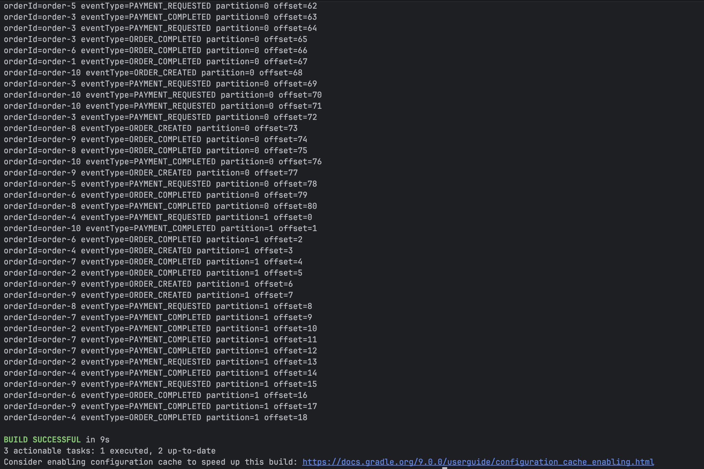
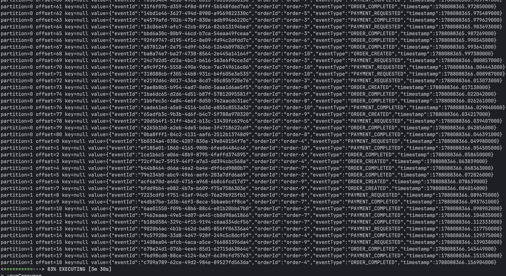
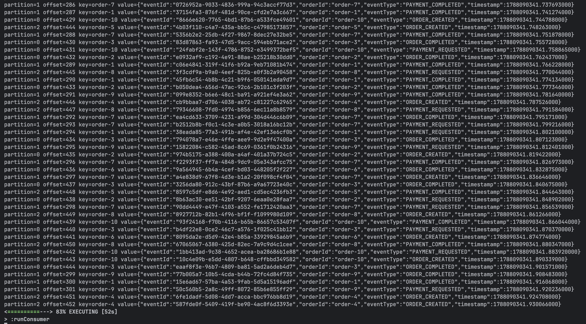
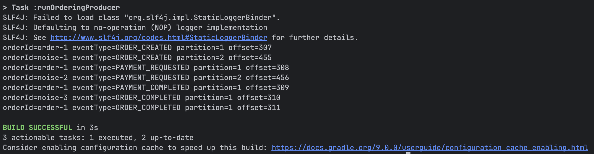
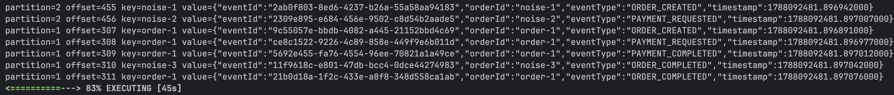

# Lab 02. Kafka Partition & Message Key

## Goals
- Kafka Topic을 여러 Partition으로 구성하고 메시지가 Partition에 분배되는 방식을 확인한다.
- Message Key 유무에 따라 메시지가 어떤 Partition으로 전달되는지 비교한다.
- 동일한 Key를 가진 메시지가 동일한 Partition으로 전달되는지 확인한다.
- Kafka의 메시지 순서 보장이 Topic 전체가 아닌 Partition 단위로 이루어진다는 것을 실험으로 확인한다.
- Partition Key 설계가 순서 보장과 병렬성에 어떤 영향을 주는지 이해한다.

## Implementation
이번 Lab은 하나의 Kafka Topic과 여러 Producer/Consumer 애플리케이션으로 구성한다.
- order-events Topic은 3개의 Partition으로 구성한다.
- OrderEventProducer
  - Message Key 유무에 따른 Partition 분배를 확인하기 위한 Producer
  - Experiment 1, 2에서 사용한다.
- OrderEventOrderingProducer
  - 동일한 Message Key를 가진 이벤트의 순서 보장을 확인하기 위한 Producer
  - Experiment 3에서 사용한다.
- OrderEventConsumer
  - order-events Topic을 구독한다.
  - 수신한 Record의 Partition, Offset, Key, Value를 출력한다.
- 주문 이벤트는 orderId를 포함하며, 실험에 따라 Message Key로 사용한다.
각 Experiment는 Producer의 전송 방식과 이벤트 구성을 달리하여 Partition 분배와 순서 보장 동작을 비교한다.

## How to Run

### 1. 카프카 실행

```bash
docker compose up -d

# 상태 확인
docker ps
```

### 2. 토픽 생성
```bash
# 토픽의 파티션 갯수 조정
docker exec lab02-kafka \
  /opt/kafka/bin/kafka-topics.sh \
  --bootstrap-server localhost:9092 \
  --create \
  --topic order-events \
  --partitions 3 \
  --replication-factor 1
```

### 3. 프로듀서 실행
```bash
./gradlew runProducer
```

### 4. 컨슈머 실행
```bash
./gradlew runConsumer
```

## Experiment 1. Produce Records Without Key
### 목적
- Message Key를 지정하지 않은 상태에서 주문 이벤트를 전송하고, Kafka Producer가 Record를 여러 Partition에 어떻게 배치하는지 확인한다.
- 동일한 orderId를 가진 이벤트가 같은 Partition에 배치되는지, 각 Partition의 Offset이 독립적으로 증가하는지 확인한다.

### 명령어
```bash
./gradlew runConsumer
./gradlew runProducer
```

Producer는 Message Key 없이 100개의 주문 이벤트를 전송한다.
```kotlin
ProducerRecord(
    "order-events",
    json
)
```
### 실제 출력

#### 1차 실행 — 100 Records

Producer 출력 일부



Consumer 출력 일부



#### 2차 실행 — 1000 Records
- 이벤트 수를 1000개로 늘려 다시 실행한 결과 Partition 2에도 Record가 배치되는 것을 확인한다.
- 따라서 첫 번째 실행에서 Partition 2가 사용되지 않은 것은 Partition이 동작하지 않는 문제가 아니라, 해당 실행에서 나타난 Partition 선택 결과였다.

### 결과
- Message Key를 전달하지 않았기 때문에 Consumer에서 모든 Record의 key가 null로 확인되었다.
- 각 Partition의 Offset은 독립적으로 관리되었다.
- 동일한 orderId를 가진 이벤트가 서로 다른 Partition에 배치되는 것을 확인했다.
- 3개의 Partition을 생성했지만 이번 실행에서는 Partition 0과 1만 사용되었고, Partition 2에는 Record가 배치되지 않았다.
- 이벤트 수를 1000개로 늘리자 Partition 0,1,2가 전부 사용되는 것을 확인했다.

### 해석 및 궁금증
- Message Key를 지정하지 않으면 orderId는 Value 내부의 데이터일 뿐이므로 Partition 선택에 영향을 주지 않는다.
    - 동일한 orderId를 가진 이벤트가 서로 다른 Partition에 배치되었으므로, 현재 구조에서는 동일 주문의 이벤트가 하나의 Partition에 배치된다는 보장이 없다.
- 100개의 Record를 전송했을 때는 Partition 2가 전혀 사용되지 않았지만, 1000개의 Record를 전송했을 때는 Partition 2도 사용되었다.
    - 이를 통해 Key가 없는 Record가 단순한 RR 방식으로 모든 Partition에 균등하게 배치되는 것은 아니며, 짧은 실행 결과만으로 Partition 사용 분포를 일반화해서는 안 된다는 점을 확인했다.
- Kafka Producer는 Key가 없는 Record를 전송할 때 batching 효율을 높이기 위해 sticky 방식으로 특정 Partition을 일정 기간 사용하는 것으로 보인다.
  - 실제로 Record가 Partition 사이에 고르게 섞여 배치되지 않고, 한 Partition에 연속적으로 생성된 뒤 다른 Partition으로 이동하는 패턴이 관찰되었다.
- 다음 실험에서는 orderId를 Message Key로 지정하고, 동일한 Key를 가진 Record가 항상 동일한 Partition으로 전달되는지 확인한다.

## Experiment 2. Produce Records With Order ID Key
### 목적
- orderId를 Message Key로 지정했을 때 동일한 주문의 이벤트가 같은 Partition에 배치되는지 확인한다.
- 이를 통해 Message Key가 Partition 선택에 어떤 영향을 주는지 확인한다.

### 명령어
```bash
./gradlew runConsumer
./gradlew runProducer
```

Producer는 orderId를 Message Key로 지정하여 주문 이벤트를 전송한다.
```kotlin
ProducerRecord(
  "order-events",
  event.orderId,
  json
)
```
### 실제 출력

Consumer 출력 일부



실행 결과 Message Key와 Partition의 관계는 다음과 같았다.

```text
order-1  -> partition 1
order-2  -> partition 0
order-3  -> partition 0
order-4  -> partition 2
order-5  -> partition 2
order-6  -> partition 0
order-7  -> partition 1
order-8  -> partition 2
order-9  -> partition 1
order-10 -> partition 0
```

### 결과
- Consumer에서 Message Key가 실제 orderId 값으로 전달되는 것을 확인했다.
- 동일한 orderId를 가진 Record는 반복해서 전송해도 항상 동일한 Partition에 배치되었다.
- 서로 다른 Message Key라도 동일한 Partition에 배치될 수 있었다.
- 서로 다른 Message Key는 여러 Partition에 분산되었으며, 이번 실행에서는 10개의 Key가 각 Partition에 4개, 3개, 3개로 비교적 고르게 분배되었다.
- 각 Partition의 Offset은 Experiment 1과 동일하게 독립적으로 증가했다.

### 해석 및 궁금증
- orderId를 Message Key로 지정하자 동일한 주문의 이벤트가 하나의 Partition으로 고정되었다.
- Kafka는 Message Key를 기반으로 Partition을 결정하므로, 동일한 Key를 사용하는 Record는 동일한 Partition에 배치된다.
- 이를 통해 비즈니스 Entity의 식별자를 Message Key로 사용할 경우 해당 Entity 단위의 이벤트를 하나의 Partition에 모을 수 있음을 확인했다.
- 다음 실험에서는 동일한 orderId에 대해 순서가 있는 이벤트를 전송하고, 같은 Partition 내부에서 메시지 순서가 유지되는지 확인한다.

## Experiment 3. Verify Ordering Within a Partition
### 목적
- 동일한 orderId를 Message Key로 사용하여 순서가 있는 주문 이벤트를 전송한다.
- 동일한 Key의 이벤트가 같은 Partition에 배치되고, 해당 Partition 내부에서 전송 순서가 유지되는지 확인한다.
- 이를 통해 Kafka의 순서 보장이 Topic 전체가 아닌 Partition 단위로 이루어진다는 것을 확인한다.

### 명령어
```bash
./gradlew runConsumer
./gradlew runOrderingProducer
```
OrderEventOrderingProducer에서는 하나의 주문에 대한 이벤트 사이에 별도의 noise 이벤트를 섞어 전송한다.

```text
val events = listOf(
    OrderEvent(..., "order-1", EventType.ORDER_CREATED, ...),
    OrderEvent(..., "noise-1", EventType.ORDER_CREATED, ...),
    OrderEvent(..., "order-1", EventType.PAYMENT_REQUESTED, ...),
    OrderEvent(..., "noise-2", EventType.PAYMENT_REQUESTED, ...),
    OrderEvent(..., "order-1", EventType.PAYMENT_COMPLETED, ...),
    OrderEvent(..., "noise-3", EventType.ORDER_COMPLETED, ...),
    OrderEvent(..., "order-1", EventType.ORDER_COMPLETED, ...)
)
```
### 실제 출력
Producer 출력



Consumer 출력



### 결과
- order-1의 모든 Record가 Partition 1에 배치되었다.
- order-1의 이벤트는 `ORDER_CREATED → PAYMENT_REQUESTED → PAYMENT_COMPLETED → ORDER_COMPLETED` 순서를 유지했다.
- noise-3도 Partition 1에 배치되어 order-1 이벤트 사이에 위치했지만, order-1 이벤트들의 상대적인 순서는 유지되었다.
- Producer의 전체 전송 순서와 Consumer의 전체 출력 순서는 동일하지 않았다.
- 각 Partition 내부에서는 Offset 순서대로 Record가 처리되는 것을 확인했다.

### 해석 및 궁금증
- Kafka의 순서 보장은 Message Key 자체에 대한 보장이 아니라, 동일한 Key가 같은 Partition으로 전달되고 해당 Partition 내부의 Record 순서가 유지되는 구조를 통해 얻어진다.
- 같은 Partition에는 서로 다른 Key의 Record가 함께 존재할 수 있다.
  - 실제로 noise-3가 order-1과 같은 Partition 1에 배치되어 Offset 310을 차지했다.
  - 그럼에도 order-1 이벤트의 상대적인 순서는 유지되었다.
- 여러 Partition에 걸친 Record의 전역적인 순서는 보장되지 않는다.
  - Producer에서는 Partition 1과 2의 Record가 서로 섞여 전송되었지만, Consumer 출력에서는 Partition 2의 Record가 먼저 출력되고 이후 Partition 1의 Record가 출력되었다.
- 따라서 Entity 단위의 순서가 필요한 경우 해당 Entity의 식별자를 Message Key로 사용해 동일한 Partition에 배치하는 것이 중요하다.

## Troubleshooting

## Key Takeaways
